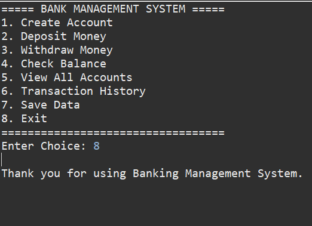

# Banking Management System

A console-based Banking Management System developed using Core Java and File Handling.

## Features
- Create Account
- Deposit Money
- Withdraw Money
- Check Balance
- View All Accounts
- Transaction History
- Save Data to File

## Technologies Used
- Core Java
- OOP Concepts
- File Handling

## Author
Shaik Farook

# Banking Management System

## Create Account

## Deposit Money

## Withdraw Money

## Check Balance

## View All Accounts

## Transaction History

## Save Data

## Exit

